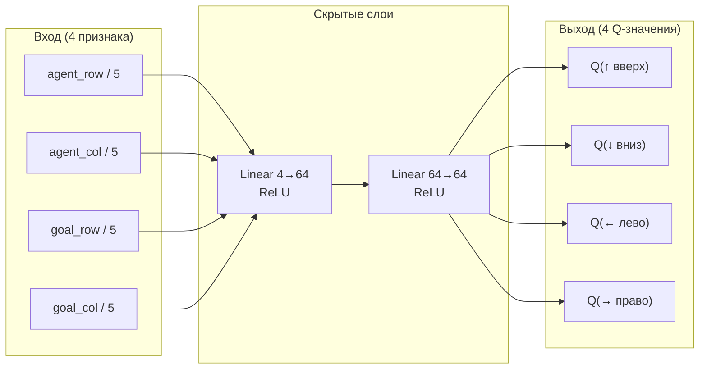
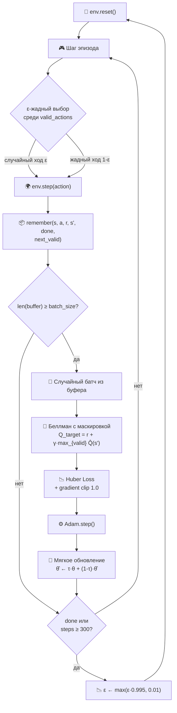

# 🧠 DQN Maze Navigator

> Агент на базе **Deep Q-Network (DQN)**, обученный самостоятельно прокладывать путь в лабиринте.  
> Реализован с нуля на **PyTorch** — без RL-фреймворков.

---

## Содержание

- [Обзор](#обзор)
- [Стек технологий](#стек-технологий)
- [Лабиринт](#лабиринт)
- [Архитектура](#архитектура)
  - [Нейронная сеть](#нейронная-сеть)
  - [Цикл обучения](#цикл-обучения)
  - [Обновление Q-значений](#обновление-q-значений)
- [Ключевые решения](#ключевые-решения)
- [Гиперпараметры](#гиперпараметры)
- [Структура наград](#структура-наград)
- [Быстрый старт](#быстрый-старт)

---

## Обзор

Агент находится в сетчатом мире 5×5 и должен найти путь от старта **A** до цели **G**, обходя стены.  
Он ничего не знает о лабиринте заранее — **политика полностью выучивается через взаимодействие со средой**.

Ключевые особенности реализации:

- **DQN с replay buffer** — обучение на случайных батчах из прошлого опыта, разрывает корреляции
- **Action masking** — агент никогда не выбирает заблокированные действия ни при обучении, ни при инференсе
- **Masked Bellman target** — Q-значения для недопустимых действий исключены из целевого значения, что устраняет деградацию обучения
- **Мягкое обновление target-сети** (τ = 0.005) — плавный перенос весов вместо резких копирований
- **Reward shaping** — промежуточный сигнал на основе манхэттенского расстояния до цели
- **Сохранение / загрузка весов** — повторный запуск автоматически пропускает обучение если модель уже обучена; при смене цели — переобучает заново

---

## Стек технологий

| Категория | Технология |
|---|---|
| **Язык** | Python 3.12 |
| **Deep Learning** | PyTorch 2.x |
| **Вычисления** | NumPy |
| **Визуализация** | Matplotlib |
| **Зависимости** | Poetry |

---

## Лабиринт

S-образный лабиринт 5×5. Верхняя стена блокирует правую сторону, нижняя — левую.  
Агент вынужден найти путь через центральный коридор.

```
 A  .  .  .  .    ← старт (0, 0)
 .  .  █  █  █    ← верхняя стена
 .  .  .  .  .    ← коридор
 █  █  █  .  .    ← нижняя стена
 .  .  .  .  G    ← цель  (4, 4)
```

**Оптимальный путь** — 8 шагов:

```
(0,0) → ↓ → (1,0) → → → (1,1) → ↓ → (2,1) → → → → → (2,4) → ↓ → (3,4) → ↓ → (4,4)
```

Стены: `(1,2)` `(1,3)` `(1,4)` `(3,0)` `(3,1)` `(3,2)`

> Набор стен задаётся списком `wall_pos` в `world.py` — можно добавить любое количество блоков.

---

## Архитектура

### Нейронная сеть

Сеть аппроксимирует функцию Q(s, a) — ожидаемую суммарную дисконтированную награду за действие `a` в состоянии `s`.



Состояние содержит и позицию агента, и позицию цели — сеть видит **куда нужно идти**, а не просто где находится.

---

### Цикл обучения



---

### Обновление Q-значений

Формула Беллмана с маскировкой недопустимых действий:

$$Q(s, a) \leftarrow r + \gamma \cdot \max_{a' \in \text{valid}(s')} \hat{Q}(s', a')$$

где:
- $\hat{Q}$ — **target network** (обновляется мягко, не скачком)
- $\text{valid}(s')$ — только те действия из $s'$, которые не ведут в стену
- Для терминальных переходов (цель достигнута): $Q(s,a) \leftarrow r$

Без маскировки в целевом значении Q-значения незаблокированных действий (никогда не выбираемых) остаются у случайной инициализации (~0) и могут ошибочно стать максимумом при `max`, что деградирует обучение.

---

## Ключевые решения

| Решение | Проблема, которую решает |
|---|---|
| **4D состояние** `[agent_row, agent_col, goal_row, goal_col]` | Сеть не может отличить "угол, нужно вниз" от "угол, нужно вправо" без цели в состоянии |
| **Action masking** в `act()` | Агент перестаёт упираться в стены и учится только на валидных ходах |
| **Masked Bellman target** | Устраняет коллапс обучения, вызванный некорректным `max Q` по заблокированным действиям |
| **Decay ε раз в эпизод** (не в шаг) | При decay по шагам ε достигало 0.01 за 7 эпизодов — агент переставал исследовать |
| **Мягкое обновление** τ=0.005 | Жёсткое копирование каждые N шагов вызывало резкий сдвиг целевых значений и нестабильность |
| **Huber Loss** вместо MSE | Устойчивость к выбросам Q-значений на старте обучения |
| **Gradient clipping** norm=1.0 | Предотвращает взрывной градиент при больших наградах/штрафах |
| **Reward shaping** ±0.1·Δdist | Явный сигнал "ближе/дальше" ускоряет сходимость на разреженных наградах |

---

## Гиперпараметры

| Параметр | Значение | Описание |
|---|---|---|
| `state_size` | 4 | Размер входного вектора |
| `action_size` | 4 | ↑ ↓ ← → |
| `lr` | 1e-3 | Скорость обучения Adam |
| `gamma` γ | 0.99 | Дисконт-фактор |
| `epsilon` ε₀ | 1.0 | Начальная вероятность случайного действия |
| `epsilon_min` | 0.01 | Минимальная вероятность исследования |
| `epsilon_decay` | 0.995 | Коэффициент убывания ε **за эпизод** |
| `batch_size` | 32 | Размер батча из replay buffer |
| `buffer_capacity` | 10 000 | Ёмкость replay buffer |
| `tau` τ | 0.005 | Коэффициент мягкого обновления target-сети |
| `hidden_size` | 64 | Нейронов в каждом скрытом слое |
| `episodes` | 300 | Эпизодов обучения по умолчанию |
| `step_limit` | 300 | Максимум шагов за эпизод |

---

## Структура наград

| Событие | Награда | Формула |
|---|---|---|
| Шаг ближе к цели | +0.2 | -0.1 + 0.1·(old\_dist - new\_dist) = -0.1 + 0.1·1 |
| Шаг нейтральный (та же дистанция) | -0.1 | -0.1 + 0.1·0 |
| Шаг дальше от цели | -0.2 | -0.1 + 0.1·(-1) |
| Удар о стену / границу | **-3.0** | (с action masking — не происходит при обучении) |
| Достижение цели | **+10.0** | — |

Оптимальный 8-шаговый путь даёт суммарную награду **+10.0** (8 × 0.0 шаг + финальная +10).

---

## Быстрый старт

### Установка

```bash
# Клонировать репозиторий
git clone https://github.com/Raisin228/test_task_sber_dev.git
cd test_task_sber_dev

# Создать виртуальное окружение и установить зависимости
poetry install
```

### Обучение

```bash
poetry run python train.py
```

При первом запуске агент обучается `episodes=300` эпизодов.  
После завершения сохраняются:
- `model_weights.pt` — веса модели
- `learned_policy.png` — график кривой обучения

При повторном запуске веса загружаются автоматически — обучение пропускается.

### Смена лабиринта / цели

Отредактируй `world.py`:

```python
self.start_pos = (0, 0)          # позиция агента
self.goal_pos  = (4, 4)          # позиция цели
self.wall_pos  = [               # список стен (любое количество)
    (1, 2), (1, 3), (1, 4),
    (3, 0), (3, 1), (3, 2),
]
```

При изменении `goal_pos` старый `model_weights.pt` будет обнаружен автоматически, удалён и запущено переобучение.

### Результат

```
=== Демонстрация обученного агента ===
 A  .  .  .  .
 .  .  █  █  █
 .  .  .  .  .
 █  █  █  .  .
 .  .  .  .  G

Шаг 1: ↓ вниз,  награда = +0.0
Шаг 2: → право, награда = +0.0
Шаг 3: ↓ вниз,  награда = +0.0
...
✓ Цель достигнута за 8 шагов. Суммарная награда: 10.00
```

---

*Автор: [@Raisin228](https://github.com/Raisin228)*
